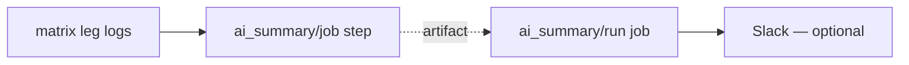

# AI-Powered CI Summaries

> Turning 10,000-line log files into one-glance reports.

## Components

- **`ai_summary/job`** — per matrix leg. Classifies failure; writes markdown + JSON.
- **`ai_summary/run`** — after the matrix. Aggregates summaries; optional Slack.

## Pipeline

## Flow

1. Extract patterns from logs.
2. Set initial status. Green stops here (no LLM).
3. Non-success → LLM returns root cause, broken layer, suggested action.

## Status

| Status                  | When |
|-------------------------|------|
| 🟢 `SUCCESS`            | No errors |
| 🟡 `EVALS_BELOW_TARGET` | Accuracy below target |
| 🟠 `TESTS_FAILED`       | Test failures |
| 🔴 `CRASHED`            | Process crashed |
| 🔴 `TIMEOUT`            | Hung or over budget |
| 🟣 `INFRA_FAILURE`      | Runner / setup / artifact issue |

Detection runs on **masked** logs: errors a test declared expected (`expect_error`)
and non-event lines (e.g. `SKIPPED`) are blanked first, so they can't flip status.
See [DESIGN — Log masking](tool/DESIGN.md#log-masking).

## Reference

- Per-leg step → [`job/README.md`](job/README.md)
- Run-level job → [`run/README.md`](run/README.md)
- Internals + invariants → [`tool/DESIGN.md`](tool/DESIGN.md)
